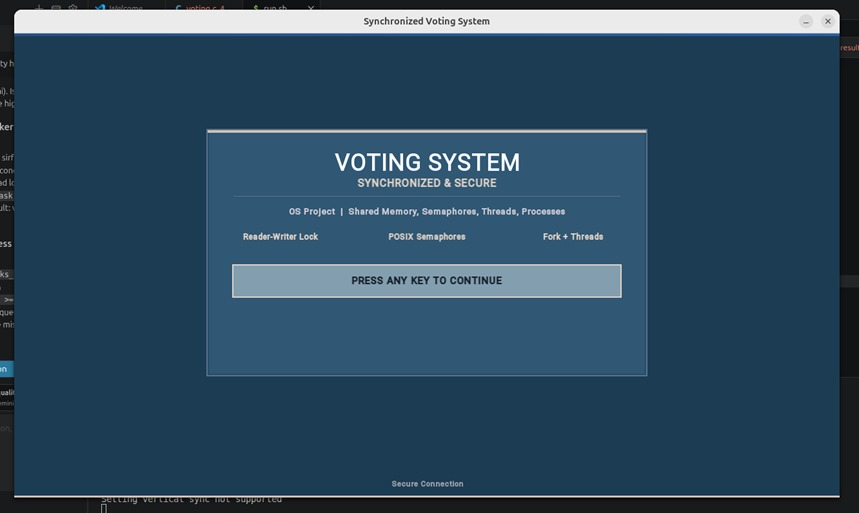
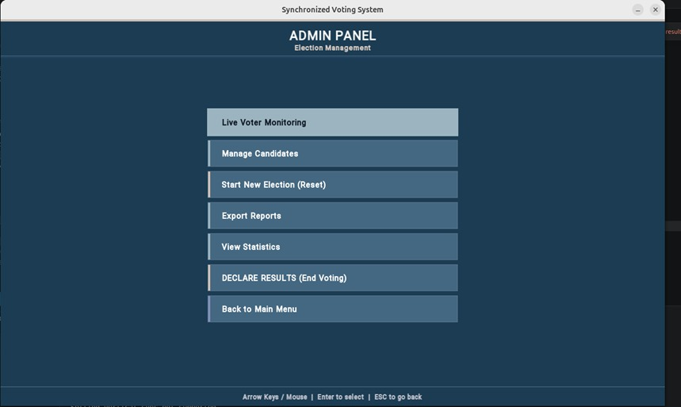
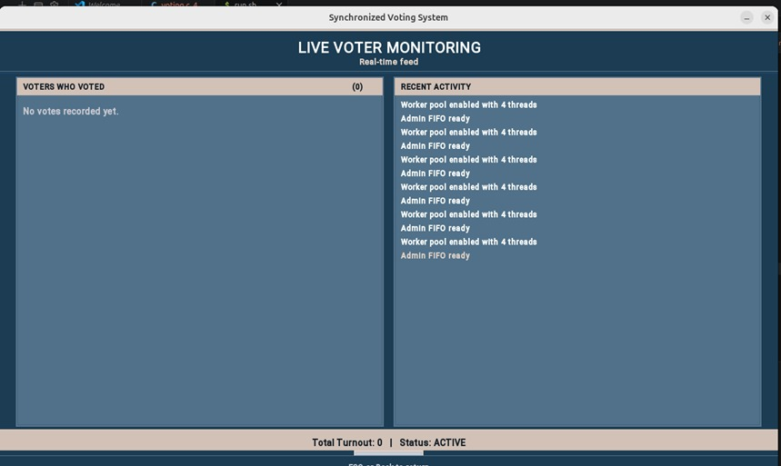
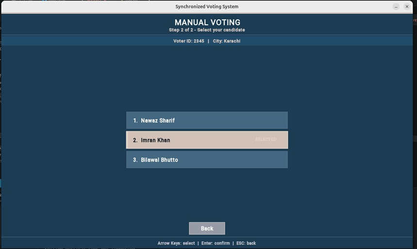
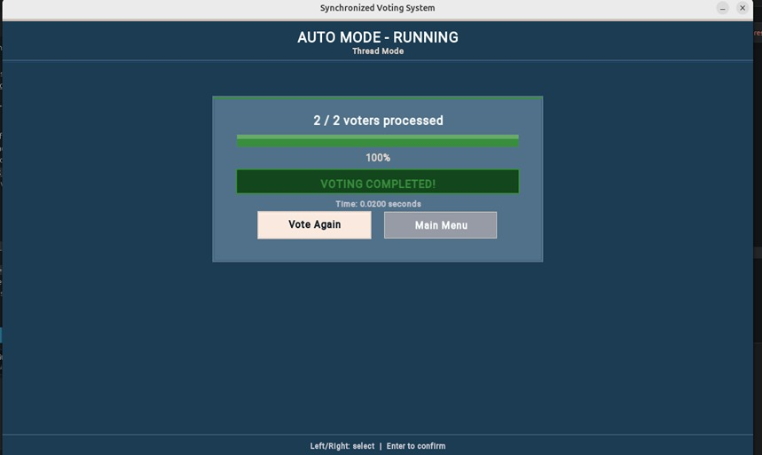
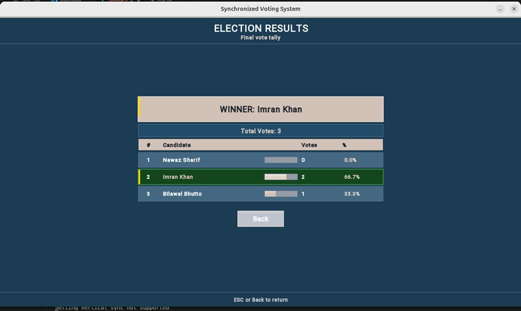
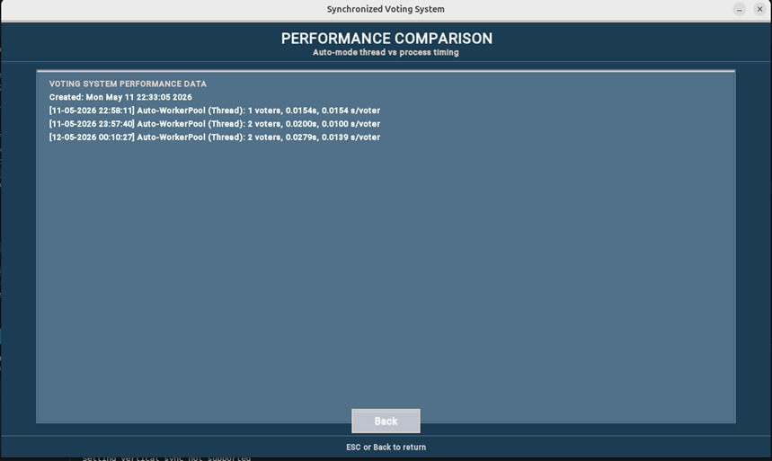
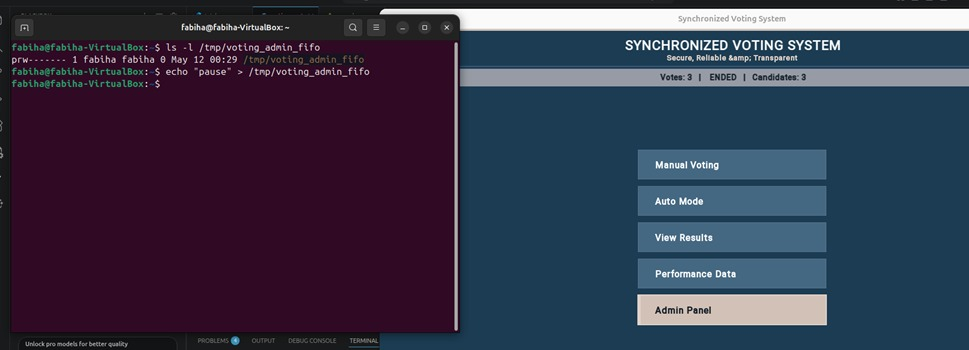

# Voting System - Synchronized Concurrency-Controlled Election Simulator

> A multi-threaded and multi-process voting system demonstrating POSIX synchronization mechanisms - Readers-Writers problem, shared memory, semaphores, worker thread pool, Named Pipe IPC, and SFML GUI.

---

## Overview

**Voting System** is the final Operating Systems project for **CS-2006** at **FAST NUCES**. It implements a synchronized, concurrency-controlled election simulator that demonstrates the classic **Readers-Writers problem** using **POSIX named semaphores** and **shared memory**.

Voters act as **writers**, result viewers act as **readers**. The system supports three operational modes - **Manual Voting**, **Auto Thread Mode (pthreads)**, and **Auto Process Mode (fork)** - with strict data integrity, duplicate vote prevention, and real-time performance analysis.

**Team Members:**
- Fabiha Siddiqui - 24K-1022
- Iqra Liaquat - 24K-1024
- Syeda Maha Fatima - 24K-0624

**Course Instructor:** Ubaid Ullah Sir | Section BCS-4J

---

## Features

| Feature | Description |
|---|---|
| **Multi-threading (pthreads)** | Concurrent voter threads in Auto Thread mode |
| **Multi-processing (fork)** | Concurrent voter processes in Auto Process mode |
| **Readers-Writers Lock** | Three POSIX named semaphores (`g_mutex`, `g_wrt`, `g_rc`) |
| **Shared Memory** | `shm_open` + `mmap` shares `VotingData` across all threads/processes |
| **Duplicate Vote Prevention** | Atomic check-and-update inside writer critical section |
| **Worker Thread Pool** | Fixed pool consuming a shared task queue - reduces per-voter overhead |
| **Named Pipe (FIFO)** | `/tmp/voting_admin_fifo` - external admin control from terminal |
| **SFML GUI** | Console-style interface with real-time live updates |
| **Performance Recorder** | Threads vs Processes wall-clock timing using `clock_gettime(CLOCK_MONOTONIC)` |
| **Timestamped Logging** | Every event appended to log file with voter ID and candidate |
| **Admin Authentication** | Password-protected admin panel |
| **Election Report Export** | Full results with percentages exported to text file |

---

## Screenshots

### 1. Main Screen

  

*Main screen with live voting status, totals, and five navigation options.*

### 2. Admin Panel

  

*Password-protected admin panel with seven control options.*

### 3. Live Voter Monitoring

  

*Real-time activity feed showing voters, candidates, and timestamped events.*

### 4. Manual Voting Mode

  

*Manually cast a vote - voter ID entry, city selection, and candidate choice.*

### 5. Auto Mode - Running

  

*Auto voting in progress with live progress bar and elapsed time.*

### 6. Election Results

  

*Final results screen with winner card, vote counts, and percentages.*

### 7. Performance Comparison

  

*Thread mode vs Process mode timing - threads run 3-4x faster.*

### 8. Named Pipe - Terminal Commands

  

*External admin control via `echo` commands sent to `/tmp/voting_admin_fifo`.*

---

## System Architecture

The system is built around a **shared memory segment** (`VotingData`) that holds:
- Candidate names and vote counters
- Voted voter IDs (for duplicate detection)
- Activity log
- Control flags (voting active, results visible)

| Component | Role |
|---|---|
| **Shared Memory (VotingData)** | Stores candidates, votes, voter IDs, activity log, control flags |
| **Readers-Writers Locks** | `g_mutex` (reader count) - `g_wrt` (exclusive writer) - `g_rc` (reader count updates) |
| **Voter Threads / Processes** | Each voter casts a single vote concurrently (pthread or fork) |
| **Observer (Result Viewer)** | Multiple readers can view results simultaneously |
| **Worker Thread Pool** | Fixed pool serving a task queue (default: 4 workers) |
| **Named Pipe (FIFO)** | External admin command channel |
| **GUI (SFML 2.6)** | Console-style rendering with live updates |
| **Logging Module** | Timestamped events to text file |
| **Performance Recorder** | Wall-clock timing per auto-voting session |

---

## Synchronization - Readers-Writers Solution

The classic **Readers-Writers problem** is solved using the **first variant (readers preference)** - appropriate for a voting system where result viewers are more frequent than voters.

### Semaphore Initialization

    g_mutex = sem_open("/voting_mutex",      O_CREAT, 0600, 1);
    g_wrt   = sem_open("/voting_write",      O_CREAT, 0600, 1);
    g_rc    = sem_open("/voting_read_count", O_CREAT, 0600, 1);

### Reader Entry / Exit

    void reader_enter(void) {
        sem_wait(g_rc);
        vd->reader_count++;
        if (vd->reader_count == 1)
            sem_wait(g_wrt);      // First reader blocks writers
        sem_post(g_rc);
    }

    void reader_exit(void) {
        sem_wait(g_rc);
        vd->reader_count--;
        if (vd->reader_count == 0)
            sem_post(g_wrt);      // Last reader unblocks writers
        sem_post(g_rc);
    }

### Writer Entry / Exit

    void writer_enter(void) { sem_wait(g_wrt); }
    void writer_exit(void)  { sem_post(g_wrt); }

---

## Core Voting Logic - Duplicate Prevention

The `cast_vote()` function encapsulates the entire critical section - checking for duplicates, incrementing counters, recording the voter ID, and logging the event atomically.

    int cast_vote(int vid, int cid) {
        writer_enter();

        if (!vd->voting_active) { writer_exit(); return -1; }

        // Duplicate check
        for (int i = 0; i < vd->voted_count; i++)
            if (vd->voted_ids[i] == vid) { writer_exit(); return -3; }

        vd->votes[cid]++;
        vd->total_votes++;
        vd->voted_ids[vd->voted_count++] = vid;

        add_activity("Voter %d -> %s", vid, vd->candidate_names[cid]);

        writer_exit();
        return 1;
    }

Because `voted_ids` lives in **shared memory**, this atomic check works correctly across both threads and forked processes.

---

## Concurrency Models

### 1. Thread Mode (pthreads)
Each voter is a POSIX thread sharing the same address space. Triggered by **same-city** entries.

    void *auto_voter_fn(void *arg) {
        ThreadArg *ta = (ThreadArg*) arg;
        cast_vote(ta->vid, ta->cid);
        free(ta);
        return NULL;
    }

### 2. Process Mode (fork)
Each voter is a separate child process. The `MAP_SHARED` mmap region is inherited across `fork()`. Triggered by **different-city** entries.

    for (int i = 0; i < voter_count; i++) {
        if (fork() == 0) {
            cast_vote(entries[i].vid, entries[i].cid);
            _exit(0);
        }
    }

### 3. Worker Thread Pool (Optimization)
A fixed pool of worker threads consumes a shared task queue, eliminating per-voter thread creation overhead.

    typedef struct { int vid; int cid; } VoteTask;

    void *worker(void *arg) {
        while (1) {
            pthread_mutex_lock(&task_mutex);
            while (task_count == 0)
                pthread_cond_wait(&task_cond, &task_mutex);
            VoteTask t = task_queue[front++];
            pthread_mutex_unlock(&task_mutex);
            cast_vote(t.vid, t.cid);
        }
    }

---

## Inter-Process Communication - Named Pipe (FIFO)

A named pipe at `/tmp/voting_admin_fifo` allows **remote administration** from any terminal session without touching the GUI.

    #define FIFO_PATH "/tmp/voting_admin_fifo"
    unlink(FIFO_PATH);
    mkfifo(FIFO_PATH, 0666);
    fifo_fd = open(FIFO_PATH, O_RDWR);
    pthread_create(&fifo_thread, NULL, fifo_listener, NULL);

### Supported Commands

| Command | Effect |
|---|---|
| `pause` | Stop accepting new votes |
| `resume` | Resume voting |
| `status` | Print current status to log |
| `declare_results` | End election and reveal results |
| `reset` | Reset entire election |
| `set_workers N` | Change worker pool size |

### Terminal Usage

    echo "pause"           > /tmp/voting_admin_fifo
    echo "declare_results" > /tmp/voting_admin_fifo
    echo "set_workers 8"   > /tmp/voting_admin_fifo

---

## Performance Measurement

Execution times are recorded using `clock_gettime(CLOCK_MONOTONIC)`. After each auto-voting session, a line is appended to `performance_data.txt`.

**Result:** Thread mode runs **3-4x faster** than process mode due to:
- Lower thread creation overhead
- No copy-on-write page faults

---

## Technologies Used

| Technology | Usage |
|---|---|
| **C / C++** | Core language for entire application |
| **POSIX Threads (pthreads)** | Concurrent voter threads |
| **POSIX Semaphores** (`sem_open`) | Readers-Writers mutual exclusion |
| **Shared Memory** (`shm_open` + `mmap`) | Shared `VotingData` across threads & processes |
| **fork() / _exit()** | Child voter processes in Auto Process mode |
| **Named Pipe** (`mkfifo`) | External admin command channel |
| **SFML 2.6** | Graphical user interface with real-time rendering |
| **clock_gettime** | High-resolution timing for performance comparison |
| **signal() / SIGINT** | Graceful cleanup of semaphores & shared memory |
| **fprintf Logging** | Timestamped event logging to text files |

---

## Getting Started

### Prerequisites

- **Linux** (Ubuntu 20.04+ recommended)
- **GCC** with C++17 support
- **SFML 2.6** development libraries
- **POSIX** development headers (`librt`, `pthread`)

### Installation (Ubuntu)

    sudo apt update
    sudo apt install build-essential libsfml-dev librt-dev

### Build & Run

    # Clone the repository
    git clone https://github.com/Fabiha188/Voting-System-OS-Project-.git
    cd Voting-System-OS-Project-

    # Compile
    g++ voting_system.c -o voting_system -lsfml-graphics -lsfml-window -lsfml-system -lpthread -lrt

    # Run
    ./voting_system

**Note:** Windows users should run this inside **WSL2** (Windows Subsystem for Linux) because POSIX named semaphores and `mkfifo` are Linux-specific.

---

## Project Structure

    Voting-System-OS-Project-/
    |-- voting_system.c              # Complete source - all modules
    |-- OS_VotingSystem_Report.docx  # Full project report
    |-- Voting_System(Proposal).docx # Initial proposal
    |-- screenshots/                 # GUI & terminal screenshots
    |   |-- 01-main-menu.jpeg
    |   |-- 02-admin-panel.jpeg
    |   |-- 03-live-monitoring.jpeg
    |   |-- 04-manual-voting.jpeg
    |   |-- 05-auto-mode.jpeg
    |   |-- 06-results.jpeg
    |   |-- 07-performance.jpeg
    |   |-- 08-fifo-terminal.jpeg
    |-- README.md

---

## System Outputs

| Output | Location | Description |
|---|---|---|
| **Vote Log** | `vote_log_[date]_[mode].txt` | Every vote with timestamp, voter ID, candidate |
| **Performance Data** | `performance_data.txt` | Thread vs Process timing per auto session |
| **Election Report** | `election_report_[date].txt` | Full results with percentages |
| **Real-time Display** | SFML Window | Live vote counts, activity feed, progress bars |
| **FIFO Responses** | In-app Activity Log | Commands like `pause`, `resume`, `status` reflected live |

---

## OS Concepts Demonstrated

- **Readers-Writers Problem** - POSIX named semaphores with reader preference
- **Mutual Exclusion** - Writer lock for atomic vote casting
- **Shared Memory IPC** - `shm_open` + `mmap` with `MAP_SHARED`
- **Multi-threading** - POSIX `pthread_create` with per-voter threads
- **Multi-processing** - `fork()` creating concurrent voter processes
- **Thread Pool Pattern** - Fixed workers consuming a task queue
- **Condition Variables** - `pthread_cond_wait` for worker scheduling
- **Named Pipe IPC** - `mkfifo` for remote admin control
- **Signal Handling** - Graceful cleanup on `SIGINT`
- **High-resolution Timing** - `clock_gettime(CLOCK_MONOTONIC)` for benchmarks
- **Race Condition Prevention** - Duplicate vote check inside critical section

---

## Limitations & Future Work

- **Single-machine only** - could be extended with TCP sockets for remote voting
- **Max 10 candidates, 100 voters** - constants can be increased with shared memory size adjustment
- **Readers preference** may cause writer starvation under extreme read load - a fair alternating solution could be added
- **SFML dependency** - a terminal-only version would be more portable on headless servers
- **Hardcoded admin password** - a hashed credential store would improve security for real-world deployment

---

## Conclusion

The **Synchronized Voting System** successfully demonstrates core Operating System concepts: Readers-Writers synchronization with POSIX semaphores, shared memory for cross-process data sharing, multi-threading with pthreads, multi-processing with fork(), worker thread pool for optimized batch scheduling, Named Pipe IPC, and quantitative performance analysis.

The system maintains strict data integrity through properly structured critical sections and prevents duplicate voting atomically. Performance measurements confirm that **threads introduce significantly less overhead than processes** - consistent with OS theory.

---

## Authors

**Fabiha Siddiqui** - **Iqra Liaquat** - **Syeda Maha Fatima**

CS-2006 Operating Systems - FAST NUCES, Karachi
Instructor: **Ubaid Ullah Sir** | Section B | CS-4J | Spring 2025

---

*Built with POSIX, pthreads, and a lot of semaphores.*
